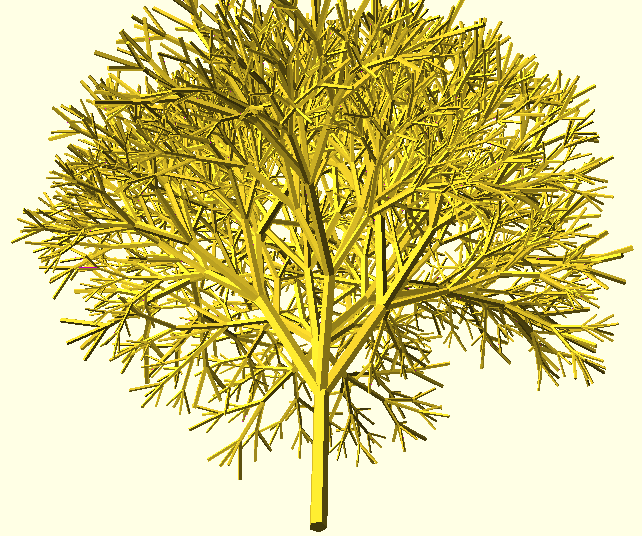
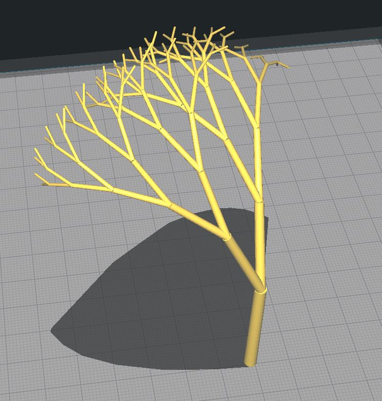
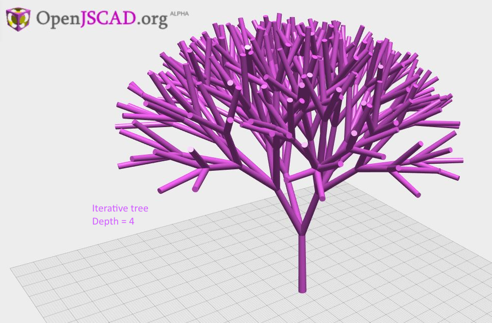
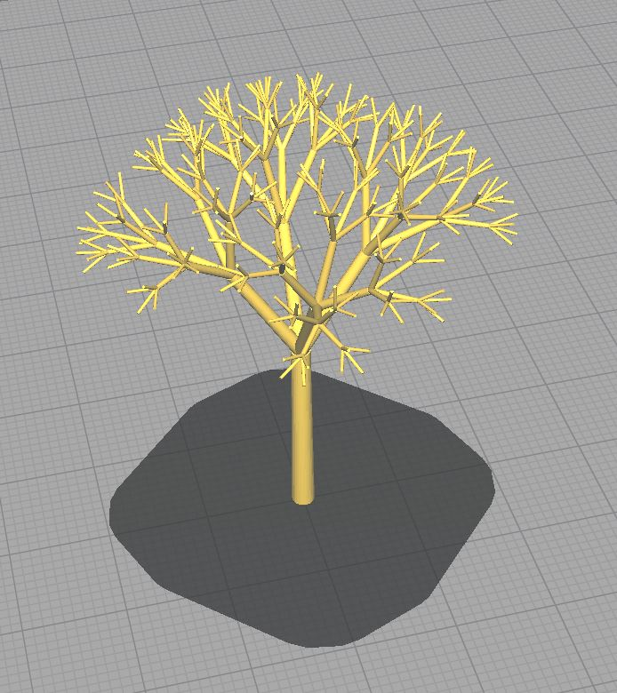

# OpenJSCAD Tree Demo #

I saw this beautiful tree [somewhere on the internet](http://smcameron.github.io/opencscad/ "I love programming my CAD now...") and got immediately inspired...

"Fractal tree" ([tree.c](https://github.com/smcameron/opencscad/blob/master/tree.c "tree.c"), 47 lines of C code.) ([source](https://github.com/smcameron/opencscad "source"))

... to make the same tree in [OpenJSCAD](https://openjscad.org/dokuwiki/doku.php "accesible CAD programming")! (spoiler: it partially works)

I ported it, then generated the following portion of a tree before node.js ate up all my RAM and crashed...

"Recursive tree with a Depth of 5" ([RecursiveTree.jscad](RecursiveTree.jscad "RecursiveTree.jscad"), 49 lines of JavaScript.) ([source](stl/RecursiveTree.stl "poor broken bastard"))

Then I made an iterative version using array-based recursion that uses MUCH less RAM ... 

Here's a web-generated tree with a Depth of 4 that uses only a few hundred megs of memory:

"Iterative tree with a Depth of 4" ([tree.jscad](tree.jscad "tree.jscad"), 44 lines of JavaScript.) ([source](stl/tree-web.stl "grab the STL"))

And another similar tree, loaded into Cura.

"Iterative tree with a Depth of 4" ([tree.jscad](tree.jscad "tree.jscad"), 44 lines of JavaScript.) ([source](stl/tree.jscad.stl "grab the STL"))

I attempted to generate the tree with a Depth of 5, as in the original. However, it failed twice, each time after about five hours computing and using all the (gig and a half) of memory I'd given node. 
([treeDepth5.jscad](treeDepth5.jscad "treeDepth5.jscad"), also 44 lines of JavaScript but won't terminate properly, for me. YMMV)

